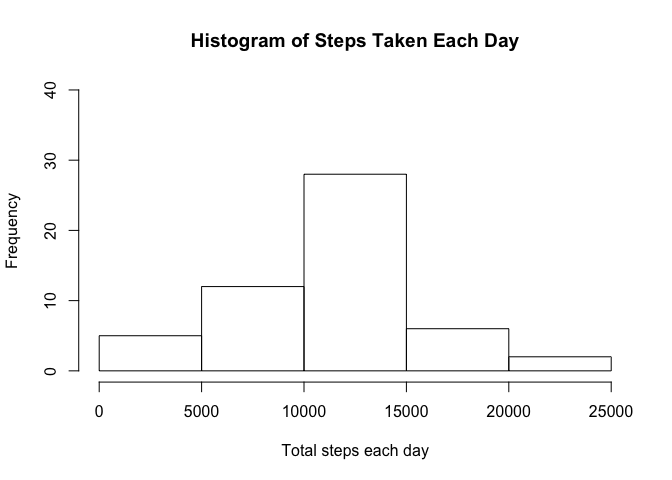
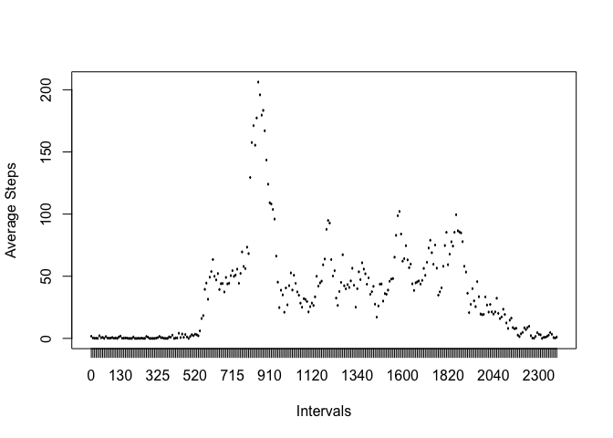
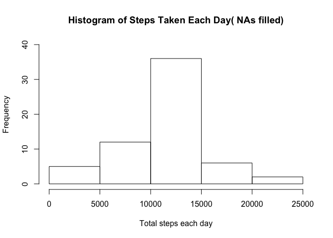
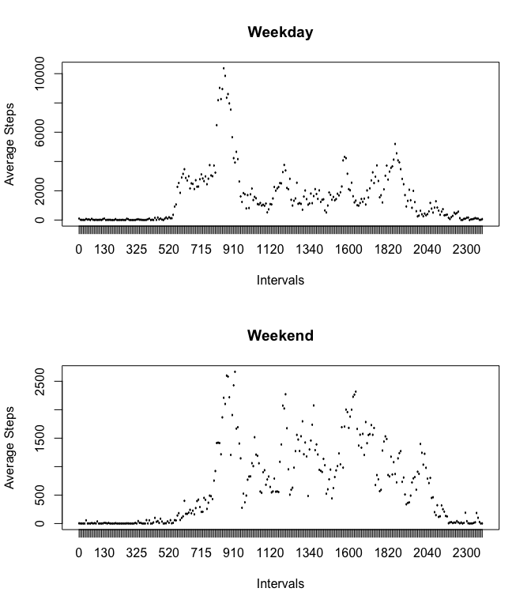

## Loading and preprocessing the data

Load the data and change the format of the "date" col.  


```r
activity <- read.csv("~/Documents/Reproducible_Data_Analysis/Week2/CourseProject1/RepData_PeerAssessment1/activity.csv")

activity$date <- as.Date(as.character(activity$date), "%Y-%m-%d")
activity$interval <- as.factor(activity$interval)
```


## What is mean total number of steps taken per day?

Calculate the taotal steps in each day and plot in a histogram.  


```r
daySum <- aggregate(steps ~ date, activity, sum)

hist(daySum$steps, main = "Histogram of Steps Taken Each Day", xlab = "Total steps each day", ylim = c(0, 40))
```

<!-- -->

Calculate the mean and median of steps taken each day.


```r
summary(daySum)[3:4, 2]
```

```
##                                     
## "Median :10765  " "Mean   :10766  "
```

## What is the average daily activity pattern?

Make a time series plot of the 5-minute interval and the average number of steps taken, averaged across all days. 


```r
intervalSum <- aggregate(steps ~ interval, activity, sum)
intervalSum$steps <- intervalSum$steps/dim.data.frame(daySum)[1]

with(intervalSum, plot(interval, steps, type = "l", xlab = "Intervals", ylab = "Average Steps"))
```

<!-- -->

Find the interval with maximum average steps.


```r
with(intervalSum, intervalSum[steps == max(steps), ])
```

```
##     interval    steps
## 104      835 206.1698
```

## Imputing missing values

1. Calculate and report the total number of missing values in the dataset (i.e. the total number of rows with NAs) 


```r
totalNAs <- sum(is.na(activity$steps))
totalNAs
```

```
## [1] 2304
```

2/3. Fill the missing values based on the average steps at that intervals and put into a new data frame.


```r
activityFilled <- activity

for (i in 1:17568) {
        if (is.na(activity[i, 1])) 
                activityFilled[i, 1] <- intervalSum[intervalSum$interval == activity[i, 3], 2]
        }
```

4. Calculate the total and report the mean and median of steps eachday using the new data frame.


```r
daySumFilled <- aggregate(steps ~ date, activityFilled, sum)

hist(daySumFilled$steps, main = "Histogram of Steps Taken Each Day( NAs filled)", xlab = "Total steps each day", ylim = c(0, 40))
```

<!-- -->

```r
summary(daySumFilled)[3:4, 2]
```

```
##                                     
## "Median :10766  " "Mean   :10766  "
```

## Are there differences in activity patterns between weekdays and weekends?

1. Create a new factor variable in the dataset with two levels -- "weekday" and "weekend" indicating whether a given date is a weekday or weekend day. 


```r
activityFilled$weekdays <- grepl("S.+", weekdays(activityFilled$date))
activityFilled$weekdays <- as.factor(activityFilled$weekdays)

levels(activityFilled$weekdays) = c("Weekday", "Weekend")
```

2. Make a panel plot containing a time series plot of the 5-minute interval (x-axis) and the average number of steps taken, averaged across all weekday days or weekend days (y-axis).


```r
par(mfrow = c(2, 1))

intervalSumWeekdays <- aggregate(steps ~ interval + weekdays, activityFilled, sum)

with(intervalSumWeekdays[intervalSumWeekdays$weekdays == "Weekday", ], plot(interval, steps, type = "l", xlab = "Intervals", ylab = "Average Steps", main = "Weekday"))

with(intervalSumWeekdays[intervalSumWeekdays$weekdays == "Weekend", ], plot(interval, steps, type = "l", xlab = "Intervals", ylab = "Average Steps", main = "Weekend"))
```

<!-- -->
